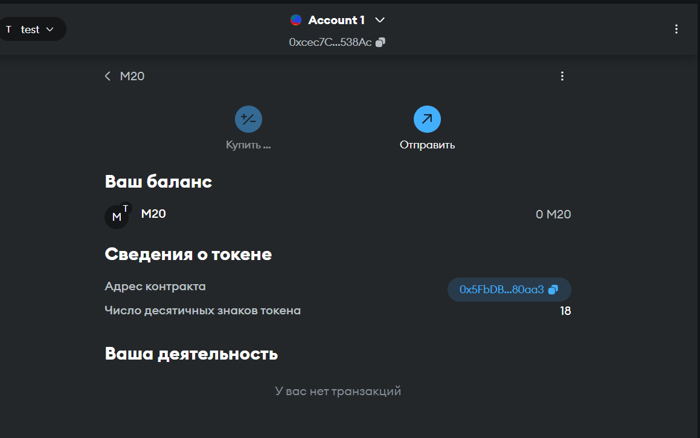

# hw1Web3

Все разложено логически по папкам

В локальной сети все задеплоилось и functions.js выполняется с минтом, но в amoy только деплоится.... минт не получилось сделать.... не знаю почему..

И также по адресу контракта, можно добавить из в метаМаск.

nft я не понял как добавить.....

Ответы на вопросы 

approve – разрешает другому адресу управлять токенами владельца (одобрение)

ERC721 – для уникальных токенов, а ERC1155 – поддерживает как уникальные, так и мульти токены

SBT – непередаваемый токен

Чтобы создать SBT, можно например убрать функцию трансфера

